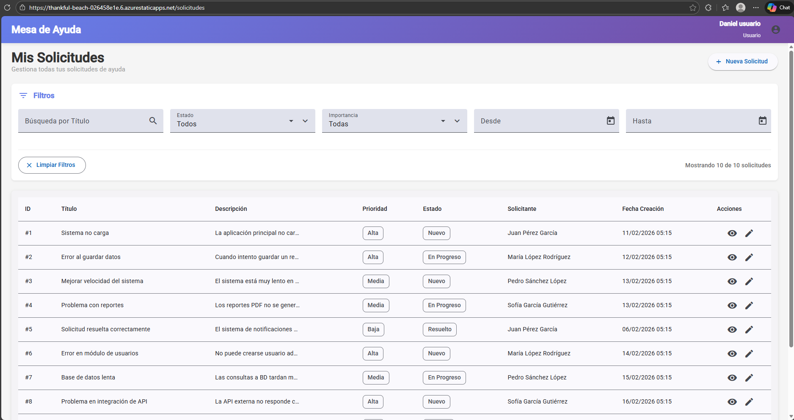
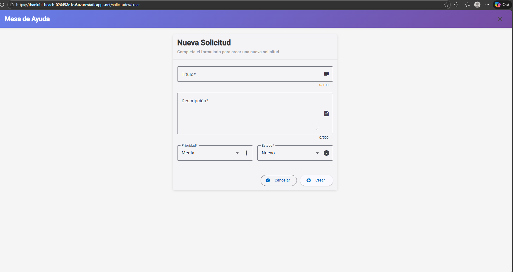
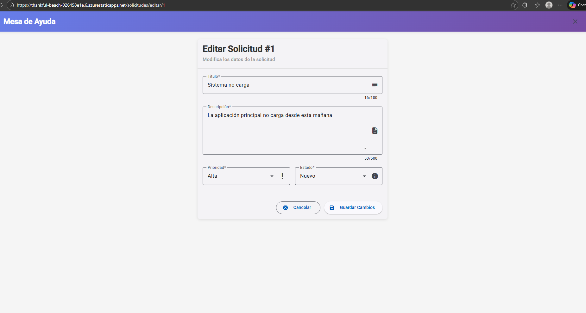
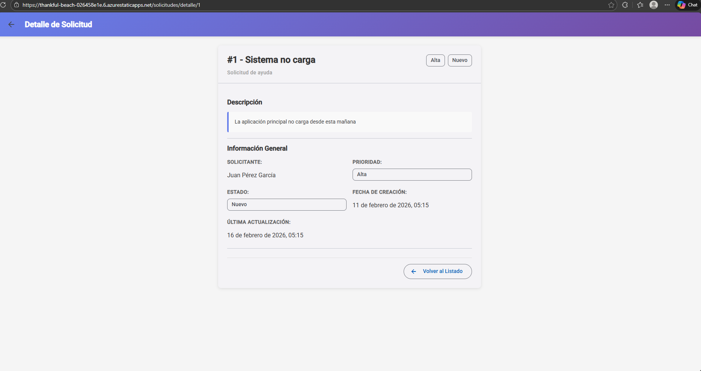
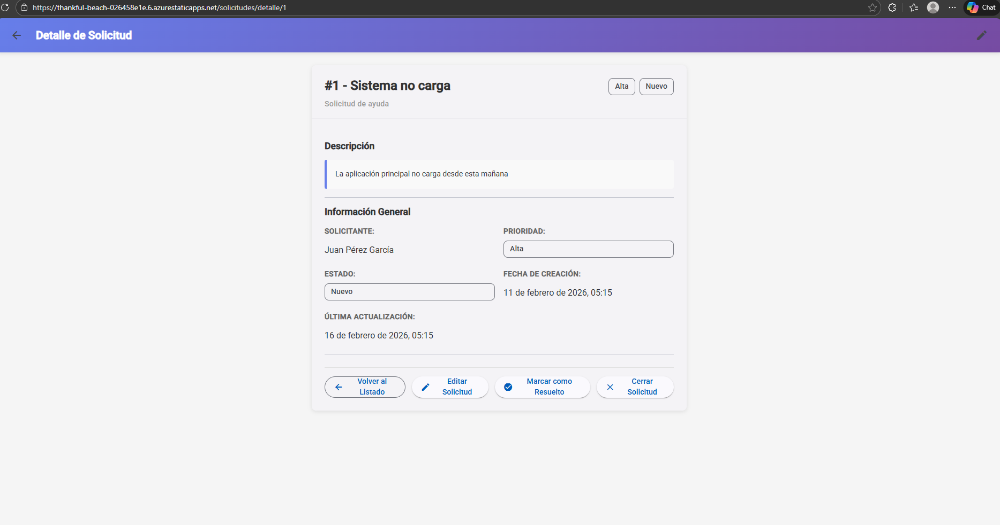
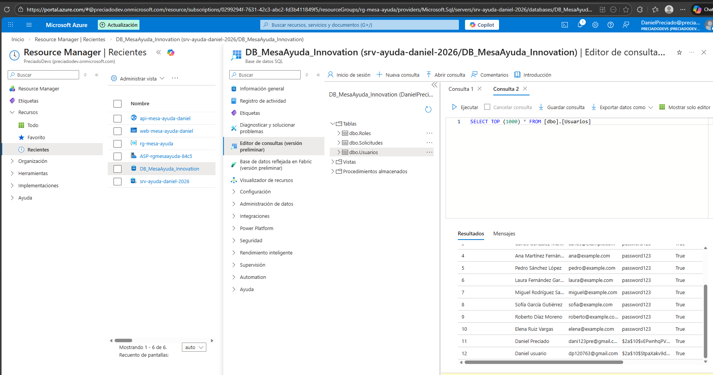

# 🚀 Sistema de Mesa de Ayuda Interna - Innovation Lab

Este proyecto es una solución Fullstack diseñada para la gestión eficiente de tickets de soporte técnico, utilizando una arquitectura moderna desacoplada y desplegada íntegramente en la nube de Azure.

## 🔗 Enlaces del Proyecto
* **Frontend (Angular):** [https://thankful-beach-026458e1e.6.azurestaticapps.net](https://thankful-beach-026458e1e.6.azurestaticapps.net)
* **Backend API (Spring Boot):** [https://api-mesa-ayuda-daniel-gqfgd2eqc8cfbxak.centralus-01.azurewebsites.net/api](https://api-mesa-ayuda-daniel-gqfgd2eqc8cfbxak.centralus-01.azurewebsites.net/api)

---

## 💻 Instrucciones de Ejecución Local

### 1. Base de Datos (SQL Server)
* Ejecuta el script ubicado en `/database/script.sql` en tu instancia local de SQL Server.
* Verifica que se hayan creado las tablas y los **10 registros de prueba** iniciales.

### 2. Backend (Spring Boot)
* Abre la carpeta `/backend` en VS Code o IntelliJ.
* Configura tus credenciales de base de datos local en `src/main/resources/application.properties`.
* Ejecuta el comando: `./mvnw spring-boot:run`.
* El API estará disponible en: `http://localhost:8080`.

### 3. Frontend (Angular)
* Navega a la carpeta `/frontend`.
* Instala las dependencias: `npm install`.
* Inicia el servidor de desarrollo: `ng serve`.
* Accede desde el navegador a: `http://localhost:4200`.

---

## ☁️ Guía de Despliegue en Azure

### 1. Backend (Azure App Service)
* **Creación:** Se configuró un **App Service** con entorno Java 21 sobre Linux.
* **Despliegue:** Se generó el artefacto `.jar` y se realizó el despliegue mediante la extensión de Azure en VS Code.
* **Configuración:**
    * Se establecieron **Variables de Entorno** para la conexión segura a Azure SQL.
    * Se configuró **CORS** para permitir únicamente el dominio del frontend.

### 2. Frontend (Azure Static Web Apps)
* **Conexión:** Vinculación directa con el repositorio de GitHub.
* **CI/CD:** Implementación de **GitHub Actions** para despliegue automatizado en cada `push` a la rama `main`.
* **Rutas de Compilación:**
    * **App location:** `/frontend`
    * **Output location:** `dist/frontend/browser`

---

## 📂 Organización del Repositorio
* **`/backend`**: API REST construida con Spring Boot y Spring Data JPA.
* **`/frontend`**: Aplicación SPA con Angular 17+ y arquitectura de servicios.
* **`/database`**: Scripts SQL completos (DDL para estructura y DML para datos).

## 🛠️ Tecnologías Utilizadas
* **Lenguajes:** Java, TypeScript, SQL.
* **Frameworks:** Spring Boot, Angular.
* **Cloud:** Azure SQL, App Service, Static Web Apps.
* **DevOps:** GitHub Actions.

## 📸 Evidencias de Funcionamiento
1. **Listado de Solicitudes:**  
2. **Creación de Usuario/Ticket:** 
3. **Edición de Usuario/Ticket:** 
4. **Detalle de Usuario/Ticket:** 
4. **Detalle de Operador/Ticket:** 
5. **Infraestructura en Azure:** 